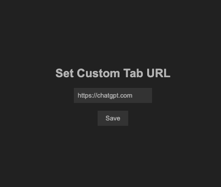

# Custom New Tab Chrome Extension

This simple Chrome extension allows you to set up a custom homepage for your new tab. By default, it redirects to [https://chat.openai.com/chat](https://chat.openai.com/chat), but you can change the URL through the extension's options page.

## Features

- **Customizable New Tab:** Set any URL as your new tab homepage.
- **Default Redirection:** Automatically redirects to [https://chat.openai.com/chat](https://chat.openai.com/chat) if no custom URL is set.
- **Simple and Clean UI:** The extension provides a straightforward way to set and manage your new tab URL.

## Screenshots

### Redirect Page

_Description: This page shows the default redirection in action, where the extension redirects the new tab to your chosen homepage._

### Options Page

_Description: The options page lets you set a custom URL for your new tab._

## Installation (developer)

1. Clone or download this repository.
2. Open Chrome and navigate to `chrome://extensions/`.
3. Enable "Developer mode" in the top right corner.
4. Click "Load unpacked" and select the directory containing this extension's files.

## Usage

- Open a new tab in Chrome to see the redirection in action.
- To change the redirection URL, enter your preferred URL to the extension's options page.

## Development

### Prerequisites

- Basic knowledge of HTML, CSS, and JavaScript.
- A working installation of Chrome.

### Files

- `manifest.json`: The configuration file for the Chrome extension.
- `newtab.html`: The HTML file for the new tab page.
- `newtab.js`: The JavaScript file that handles the redirection logic.
- `options.html`: The HTML file for the options page.
- `options.js`: The JavaScript file that saves and retrieves the custom homepage URL.

## Contributing

Feel free to fork the repository and submit a pull request if you'd like to contribute to this project. Please make sure your code is well-documented and follows the existing coding style.

## Privacy

This Chrome extension does NOT collect, store, or share ANY personal data, browsing history, or user information. All data related to your custom new tab settings is stored locally on your device and not transmitted to external servers. 

The only permissions required are those necessary for the extension to function, such as modifying your new tab page. We respect your privacy and ensure no data is shared with third parties.

Please refer to the [PRIVACY.md](./PRIVACY.md) file for more details.

## License

This project is licensed under the MIT License. See the [LICENCE.md](./LICENSE.md) file for more details.

--- 

## Don't want an extention? Use a default search engine.

### Set ChatGPT as Your Default Search Engine in Chrome

1. **Open Chrome Settings:**
   - Go to `chrome://settings/search`.

2. **Manage Search Engines:**
   - Click **Manage search engines and site search**.

3. **Add a new Search Site**
   - Click the **Add** button

3. **Add ChatGPT:**
   - After Clicking **Add** and enter:
     - **Search engine:** `ChatGPT`
     - **Keyword:** `chatgpt`
     - **URL:** `https://chat.openai.com/chat?q=%s`

4. **Make Default:**
   - Find `ChatGPT` in the list,
   - Click the three dots, and
   - select **Make default**.
  

Now, typing queries in the address bar will redirect to ChatGPT.
