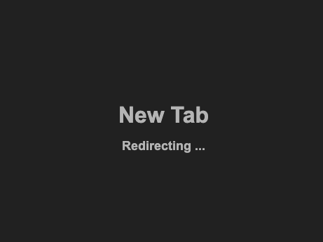

# Custom New Tab Chrome Extension

This Chrome extension allows you to set a custom homepage for your new tab. By default, it redirects to [https://chat.openai.com/chat](https://chat.openai.com/chat), but you can change the URL through the extension's options page.

## Don't want an extention? Use a default search engine

### Set ChatGPT as Your Default Search Engine in Chrome

1. **Open Chrome Settings:**
   - Go to `chrome://settings/search`.

2. **Manage Search Engines:**
   - Click **Manage search engines and site search**.

3. **Add ChatGPT:**
   - Click **Add** and enter:
     - **Search engine:** `ChatGPT`
     - **Keyword:** `chatgpt`
     - **URL:** `https://chat.openai.com/chat?q=%s`

4. **Make Default:**
   - Find `ChatGPT` in the list, click the three dots, and select **Make default**.

Now, typing queries in the address bar will redirect to ChatGPT.

## Features

- **Customizable New Tab:** Set any URL as your new tab homepage.
- **Default Redirection:** Automatically redirects to [https://chat.openai.com/chat](https://chat.openai.com/chat) if no custom URL is set.
- **Simple and Clean UI:** The extension provides a straightforward way to set and manage your new tab URL.

## Screenshots

### Redirect Page

_Description: This page shows the default redirection in action, where the extension redirects the new tab to your chosen homepage._

### Options Page

_Description: The options page allows you to set a custom URL for your new tab._

## Installation

1. Clone or download this repository.
2. Open Chrome and navigate to `chrome://extensions/`.
3. Enable "Developer mode" in the top right corner.
4. Click "Load unpacked" and select the directory containing this extension's files.

## Usage

- Open a new tab in Chrome to see the redirection in action.
- To change the redirection URL, go to the extension's options page and enter your preferred URL.

## Development

### Prerequisites

- Basic knowledge of HTML, CSS, and JavaScript.
- A working installation of Chrome.

### Files

- `manifest.json`: The configuration file for the Chrome extension.
- `newtab.html`: The HTML file for the new tab page.
- `newtab.js`: The JavaScript file that handles the redirection logic.
- `options.html`: The HTML file for the options page.
- `options.js`: The JavaScript file that handles saving and retrieving the custom homepage URL.

## Contributing

If you'd like to contribute to this project, feel free to fork the repository and submit a pull request. Please make sure your code is well-documented and follows the existing coding style.

## License

This project is licensed under the MIT License. See the `LICENSE` file for more details.